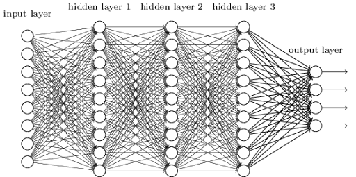

# Deep Learning and Deep Neural Networks

Deep Learning is a branch of Machine Learning that uses **Neural Networks** with multiple layers to learn complex patterns directly from data.

At its core, a neural network is simply a mathematical function:

$$
y = f(x;\theta)
$$

where:

- $x$ = Input
- $y$ = Prediction
- $\theta$ = Learnable parameters (weights and biases)

The goal of training is to find the best values of $\theta$ such that:

$$
y_{pred} \approx y_{true}
$$

---

## From a Single Neuron to a Neural Network

A single neuron performs:

$$
y = mx + c
$$

or in vector form:

$$
y = Wx + b
$$

where:

- $W$ = Weight Matrix
- $x$ = Input Features
- $b$ = Bias

A single neuron can only learn simple relationships.

To learn complex relationships, we stack many neurons together.

This collection of interconnected neurons forms a **Neural Network**.

---

## Fully Connected Layers


*Figure 1: Fully Connected Neural Network Architecture*

In a Fully Connected Layer, every neuron from the previous layer is connected to every neuron in the next layer.

```text
Input Layer
      ↓
Hidden Layer
      ↓
Hidden Layer
      ↓
Output Layer
```

Every connection has its own learnable weight.

This allows information from different input features to interact with each other.

---

## Why Fully Connected Layers Matter

Suppose we want to identify a person from an image.

Individual pixels by themselves contain very little information.

However, by combining information from many pixels simultaneously, the network can learn:

- Edges
- Shapes
- Eyes
- Nose
- Face Structure
- Identity

A Fully Connected Layer allows each neuron to examine information coming from **all neurons in the previous layer**, making it possible to learn rich feature interactions.

---

## Multi-Layer Perceptron (MLP)

A Multi-Layer Perceptron (MLP) is the simplest form of a Deep Neural Network.

It consists of:

```text
Input Layer
      ↓
Hidden Layer
      ↓
Hidden Layer
      ↓
Output Layer
```

Each layer performs:

$$
y = Wx + b
$$

followed by a non-linear activation function.

The output of one layer becomes the input to the next layer.

As data moves deeper into the network, the learned representation becomes increasingly abstract and meaningful.

---

## Learning Complex Relationships

Consider a simple neuron:

$$
y = mx + c
$$

This can only learn a straight line.

Many real-world problems are far more complex:

- Image Recognition
- Speech Recognition
- Language Understanding
- Medical Diagnosis

By stacking multiple layers together, the network can learn highly non-linear functions that cannot be represented by a single neuron.

Each layer gradually transforms the input into a richer representation.

---

## Why Are Neural Networks Called Universal Function Approximators?

One of the most important results in Deep Learning is the **Universal Approximation Theorem**.

It states that:

> A neural network with enough neurons and a non-linear activation function can approximate any continuous function to arbitrary accuracy.

Mathematically:

$$
f(x)
\approx
NN(x;\theta)
$$

where:

- $f(x)$ is any target function.
- $NN(x;\theta)$ is a neural network.

This means neural networks are not limited to learning lines, curves, or specific equations.

They can learn:

- Image Classification Functions
- Language Translation Functions
- Speech Generation Functions
- Object Detection Functions
- Complex Physical Simulations

and many other mappings directly from data.

---

## Intuition Behind Universal Approximation

Think of a neural network as a giant function-building machine.

A single neuron learns:

$$
y = mx + c
$$

A layer learns many such functions.

Multiple layers combine those functions together.

Eventually, the network can construct extremely complex mathematical relationships that closely match the desired target function.

The more expressive the network, the more complicated the functions it can approximate.

---

## Training a Neural Network

Training follows the same cycle:

```text
Input
  ↓
Forward Pass
  ↓
Prediction
  ↓
Loss Calculation
  ↓
Gradient Descent
  ↓
Parameter Update
  ↓
Better Prediction
```

The network continuously updates its weights and biases until the predictions become close to the ground truth.

---

## Key Takeaways

- Deep Learning uses Neural Networks to learn patterns from data.
- A Fully Connected Layer connects every neuron to every neuron in the next layer.
- An MLP is the simplest type of Deep Neural Network.
- Stacking layers allows the network to learn increasingly complex relationships.
- Neural Networks are called Universal Function Approximators because they can approximate any continuous function given sufficient capacity.
- Modern AI systems such as CNNs, Transformers, GPTs, U-Nets, Diffusion Models, and GANs are all built upon these same fundamental principles.